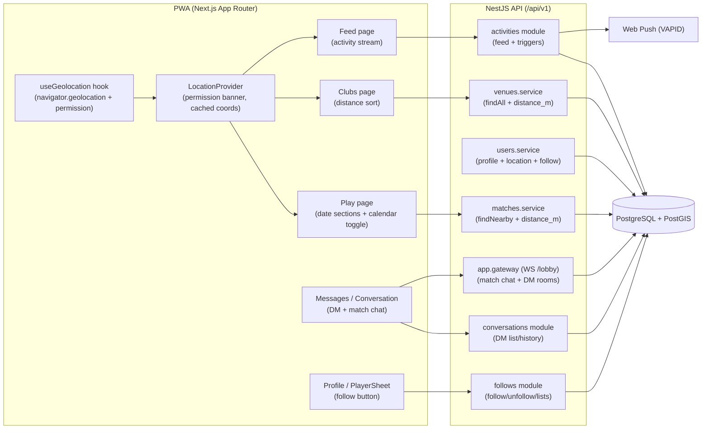

# Gate 2 — Architecture: Location & Social Discovery Program

**Cycle:** `social-discovery`
**Date:** 2026-08-14
**Status:** Draft for approval (Gate 2 → 3)

---

## 1. Architecture overview

**Key insight:** the geo/query layer (M, V) already exists. Track A is ~80% client
(geolocation + wiring) + an infra prerequisite (HTTPS) + a tiny persistence
column. Tracks C/D are net-new modules over already-migrated DM tables (C) and a
new activity model (D).

---

## 2. Track A — Full location services

### 2.1 Schema
- `users` + `home_lat doublePrecision NULL`, `home_lng doublePrecision NULL`
  (migration `0007_user_location.sql`). Persist last-known location for
  returning sessions; keeps a fast default even before a fresh GPS fix.

### 2.2 Backend (minimal)
- `UpdateProfileDto` + `users.service.updateProfile()` accept optional
  `home_lat`/`home_lng`; `GET /users/me` returns them.
- `matches.findNearby()` and `venues.findAll()` are **unchanged** — already
  accept `lat`/`lng`/`radius_km` and emit `distance_m` (verified).
- **Radius default:** change `findNearby`/`findAll` default `radius_km` from
  `10` → `50` when coords are present (Riyadh-wide). No coords → no geo filter
  (returns all), which is already the behaviour.

### 2.3 Frontend
- **New** `hooks/useGeolocation.ts` — wraps `getCurrentPosition` + `watchPosition`,
  exposes `{ coords, status: 'idle'|'prompting'|'granted'|'denied'|'error', request(), error }`,
  caches last fix in `localStorage`, never throws on denial.
- **New** `components/providers/LocationProvider.tsx` — client provider mounting
  a one-time permission prompt (respecting `fireOnMount`-style suppression in
  sheets) and a dismissible "Enable location" banner; feeds coords via context.
- **Change** `hooks/useMatches.ts` — add `lat`/`lng`/`radius_km` to `filters`
  and query params (mirrors `useVenues`).
- **Change** `clubs/page.tsx` — read coords from `LocationProvider`, pass to
  `useVenues({ lat, lng })`; distance badge already renders when `distance_m`
  is non-null.
- **Change** `play/page.tsx` — pass coords to `useMatches`.
- **Change** `MatchCard.tsx` — add distance badge (`{distanceM}` formatted
  "X.X km") using existing badge style (like clubs).
- **Infra prerequisite (CRITICAL):** serve PWA over HTTPS on Tailscale
  (`tailscale cert` + `tailscale serve` for `*.ts.net`) or TLS reverse proxy,
  otherwise `navigator.geolocation` is `undefined` on-device.

---

## 3. Track B — Play screen rich first-look

### 3.1 Backend
- None. `findNearby()` already returns **all upcoming matches** when `date` is
  absent, sorted `scheduled_at ASC` (soonest first) with `distance_m` per row.

### 3.2 Frontend
- **Change** `play/page.tsx`:
  - `selectedDate` default `null` (all games) — suppress `DatePicker` mount-fire
    by passing `fireOnMount={false}` and `selectedDate` (controlled; prop
    already exists).
  - Toggle-clear: `onDateSelect(d)` → if `d === selectedDate`, set `null`;
    else set `d`.
  - Group the flat list into **date buckets** (by `scheduled_at` local date)
    and render section headers.
- **New** helper `lib/formatDate.ts` — `formatDateSection(date, locale)` using
  `Intl.DateTimeFormat(locale, { weekday:'long', day:'numeric', month:'long',
  year:'numeric' })` → "Friday, 15 August 2026" / Arabic "الجمعة، ١٥ أغسطس ٢٠٢٦".
- **New** component `components/matches/MatchDateSections.tsx` — takes `Match[]`,
  buckets by date, renders header + `MatchCard[]`, sorted within a bucket by
  `distanceM` (nearest first) when coords present, else chronological.
- `useMatches` already re-fetches on `date`/`filters` change via `queryKey`.

---

## 4. Track C — Follow + direct messaging

### 4.1 Schema (migration `0008_follows_and_read.sql`)
- **New** `follows` table: `follower_id` (FK users, cascade), `following_id`
  (FK users, cascade), `created_at`; `uniqueIndex(follower_id, following_id)`;
  index on `following_id`.
- **Change** `conversation_participants` + `last_read_at timestamp NULL`
  (per-participant read cursor → unread counts).

### 4.2 Backend — new `follows` module
| Endpoint | Method | Returns |
|----------|--------|---------|
| `POST /users/:id/follow` | POST | `{ following: true, followersCount, followingCount }` |
| `DELETE /users/:id/follow` | DELETE | `{ following: false, followersCount, followingCount }` |
| `GET /users/me/followers` | GET | `UserSummary[]` |
| `GET /users/me/following` | GET | `UserSummary[]` |

- `GET /users/:id` enriched with `isFollowing` (for current user), `followersCount`,
  `followingCount`.

### 4.3 Backend — new `conversations` module (reuse migrated DM tables)
| Endpoint | Method | Returns |
|----------|--------|---------|
| `POST /conversations` (body `{ userId }`) | POST | find-or-create 1:1 → `Conversation` |
| `GET /conversations` | GET | `ConversationSummary[]` (last msg + unread) |
| `GET /conversations/:id/messages` | GET | `PersonalMessage[]` (history, paginated) |
| `POST /conversations/:id/messages` | POST | `PersonalMessage` (fallback to REST; WS primary) |

- **WS (`app.gateway.ts`)** — add `join-conversation` (room `conv:<id>`, auth
  checks participant) and `send-dm` (insert `personal_messages`, update
  `last_read_at` for sender, emit `new-dm` to `conv:<id>` + `dm-notification`
  to recipient's presence room). Mutations follow the mutation contract
  (`findOne`-equivalent: return the full message with sender).

### 4.4 Frontend
- **New hooks:** `useFollow`, `useFollowers`, `useFollowing`,
  `useConversations`, `useConversationMessages` (REST + WS, mirrors
  `useMatchChat`).
- **New components:** `FollowButton` (Follow/Following/Unfollow states),
  `FollowersSheet`/`FollowingSheet`.
- **New route:** `[locale]/messages/[id]` — conversation chat view (resolves
  the currently-dead link referenced by `messages/page.tsx`).
- **Change** `messages/page.tsx` — merge `useConversations` (direct DMs) with
  `useDiscussions` (match chats) into one list, DMs first.
- **Change** `PlayerProfileSheet` + profile page — add `FollowButton` + counts.

---

## 5. Track D — Lively activity feed + notification triggers

### 5.1 Schema (migration `0009_activities.sql`)
- **New** `activities`: `id`, `actor_id` (FK users), `verb` (enum
  `'created_match'|'joined_match'|'followed'|'messaged'|'pom_decided'`),
  `match_id` (nullable FK), `subject_id` (nullable), `created_at`.
- **New** `feed_items` (fan-out on write, scalable): `id`, `recipient_id` (FK
  users, cascade), `activity_id` (FK activities, cascade), `is_read bool`,
  `created_at`; index `(recipient_id, created_at DESC)`.

### 5.2 Backend — new `activities` module + trigger hooks
- **Trigger hooks** (called from owning services, inside their transactions):
  - `matches.createMatch` → activity `created_match`; fan-out to host's followers.
  - `matches.joinMatch` → activity `joined_match`; fan-out to other participants + host.
  - `follows.follow` → activity `followed`; fan-out to followee.
  - `conversations.sendMessage` → activity `messaged`; fan-out to other participant.
  - `matches.completeMatch`/POM winner → activity `pom_decided`; fan-out to participants.
- **`GET /users/me/feed`** — `feed_items` joined to `activities`, ordered by
  **relevance score** (see Gate 3; internal only, never labelled on-screen).
- **`GET /users/me/notifications`** — same data, filtered to "directed at me"
  events (followed, messaged, pom_decided, joined-my-match).

### 5.3 Frontend
- **New** `hooks/useFeed.ts` + `hooks/useNotifications.ts`.
- **Rewrite** `(main)/page.tsx` — render `ActivityCard[]` instead of match cards.
- **New** `components/feed/ActivityCard.tsx` — type→icon map + localised
  activity sentence + deep-link (`match/:id`, `profile`, `messages/:id`,
  `clubs/:id`).

---

## 6. Key data-flow (one canonical flow per track)

**A/B — "nearest games, all dates":**
`LocationProvider (coords)` → `useMatches({ lat, lng, date? })` →
`GET /matches?lat&lng` → `findNearby` (ST_Distance → `distance_m`) →
`adaptMatchList` → `MatchDateSections` (bucket + sort) → `MatchCard` (distance badge).

**C — "send a DM":**
`ChatView` → `useConversationMessages.sendMessage` → WS `send-dm` →
`app.gateway` inserts `personal_messages` → emits `new-dm` to `conv:<id>` →
subscribed clients append → history persists via `GET /conversations/:id/messages`.

**D — "X joined your match":**
`matches.joinMatch` (tx) → `activities.insert` + `feed_items.insert` (fan-out) →
`GET /users/me/feed` returns it → `ActivityCard` deep-links to `match/:id`.

---

## 7. Files changed (summary)

### Backend (`apps/api/`)
| File | Change |
|------|--------|
| `src/database/schema.ts` | +`follows`, +`activities`, +`feed_items`, +`users.home_lat/home_lng`, +`conversation_participants.last_read_at` |
| `drizzle/0007_user_location.sql` (new) | user location columns |
| `drizzle/0008_follows_and_read.sql` (new) | follows + read cursor |
| `drizzle/0009_activities.sql` (new) | activities + feed_items |
| `src/modules/follows/*` (new) | controller/service/module/DTO |
| `src/modules/conversations/*` (new) | controller/service/module/DTO |
| `src/modules/activities/*` (new) | controller/service/module + trigger hooks |
| `src/modules/users/users.service.ts` + `dto/update-profile.dto.ts` | location persistence |
| `src/modules/matches/matches.service.ts` | radius default 50; trigger hooks |
| `src/modules/gateway/app.gateway.ts` | `join-conversation` + `send-dm` rooms |
| `src/app.module.ts` | register 3 new modules |

### Frontend (`apps/player-pwa/`)
| File | Change |
|------|--------|
| `src/hooks/useGeolocation.ts` (new) | geolocation hook |
| `src/hooks/useMatches.ts` | +lat/lng/radius params |
| `src/hooks/useFollow.ts` / `useFollowers.ts` / `useFollowing.ts` (new) | follow hooks |
| `src/hooks/useConversations.ts` / `useConversationMessages.ts` (new) | DM hooks |
| `src/hooks/useFeed.ts` / `useNotifications.ts` (new) | feed hooks |
| `src/components/providers/LocationProvider.tsx` (new) | permission + coords context |
| `src/components/matches/MatchDateSections.tsx` (new) | date-sectioned list |
| `src/components/matches/MatchCard.tsx` | distance badge |
| `src/components/feed/ActivityCard.tsx` (new) | activity item |
| `src/components/features/FollowButton.tsx` (new) | follow CTA |
| `src/app/[locale]/(main)/play/page.tsx` | all-games default + toggle-clear + sections |
| `src/app/[locale]/(main)/clubs/page.tsx` | pass coords |
| `src/app/[locale]/(main)/page.tsx` | rewrite as activity feed |
| `src/app/[locale]/(main)/messages/page.tsx` | merge DM + discussions |
| `src/app/[locale]/messages/[id]/page.tsx` (new) | conversation chat view |
| `src/app/[locale]/(main)/profile/page.tsx` + `PlayerProfileSheet.tsx` | follow button |
| `src/lib/formatDate.ts` (new) | date-section formatter |
| `src/messages/en.json` + `ar.json` | new i18n namespaces |

---

## 8. i18n namespaces (high-level; exact keys at Gate 3)

`location.*` (permission title/body/enable/later), `play.dateSections.*`,
`follow.*` (follow/following/unfollow/followers/following lists),
`messages.dm.*` (direct, newConversation, unread), `feed.*` (activity verbs),
`notifications.*` (title, markRead, empty), `distance.*` (format).

---

## 9. Risks & mitigations

| Risk | Mitigation |
|------|-----------|
| Geolocation blocked on HTTP | HTTPS prerequisite is Slice A1's first step; graceful `denied` fallback keeps app usable |
| Feed fan-out write cost | `feed_items` indexed on `(recipient_id, created_at DESC)`; fan-out bounded to follower sets; defer geo-based fan-out |
| DM tables drift (migrated, unused) | Build against existing schema; only add `last_read_at` |
| RTL date sections | `Intl.DateTimeFormat` with locale — never hand-rolled |
| Trigger hooks hidden in service code | Central `activities.service.record()` helper + explicit hook calls, documented in Gate 3 |
| Scope creep across 4 tracks | Enforce per-track slices; hard gate build+test per slice |

## 10. Descoped (this cycle)

Group chats (beyond 1:1), read receipts/typing, block/report, push for
follow/message triggers (in-app only), venue-owner/admin feed, geo-based
auto-fan-out ("games near you" push).
